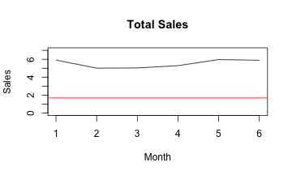

## Safety Stock Demo
Developing Data Products Assignment


--- .class #id
## Main Idea
We have a set of sales for manufacturing goods. We would like based on those information, calculate the safety stocks needed. The safety stock is the quantity to have permanently to react to demand variability. The safety stock is linked to a notion of service level and is based on the production or procurement leadtimes of our goods.
The demo aims to show the impact of the change of the service level and the Lead time on the calculation of the safety stock.

The main formula I am using is: Safety Stock = 
$$latex
SS(z,ldt,\sigma) = z{\sigma\sqrt{ldt}}   
$$
- z is the service level coefficient expressed as the qnorm of Service level in percentage
- $$latex \sigma $$ is the serie standard deviation
- ldt: Lead Time is the total procurement lead time

--- &twocol
## Preparing the data
*** =fullwidth

For the purpose of the exercise, I am using the following set of items: representing the months and the associated sales volume. We plot the safety stock with the assumption of a lead time of 5 and 90% service level in red line.    


```r
mydata <-data.frame("Month"=c("jul-14","aug-14","sep-14","oct-14","nov-14","dec-14"),"SALES"=c(5.91,5.01,5.03,5.29,5.97,5.89))

 mydata
```

```
##    Month SALES
## 1 jul-14  5.91
## 2 aug-14  5.01
## 3 sep-14  5.03
## 4 oct-14  5.29
## 5 nov-14  5.97
## 6 dec-14  5.89
```

```r
plot(mydata$SALES, xlab="Month",ylab="Sales",ylim=c(0,7),type="l", main='Total Sales')
ss <- max(sd(mydata$SALES)*qnorm(0.9)*sqrt(5),0)
   abline(h=ss,col="red")
```

 

--- &twocol
## Impacts of the service level on safety stock
*** =fullwidth

Let assume that the ldt is equal to 5 and change the service level from 90% to 95%.
We see that the safety stock is increasing from 1.309777 to 1.68108

*** =left

```r
plot(mydata$SALES, xlab="Month",ylab="Sales",ylim=c(0,7),type="l", main='Total Sales')
ss <- max(sd(mydata$SALES)*qnorm(0.9)*sqrt(5),0)
   abline(h=ss,col="red")
```

 

```r
print(ss)
```

```
## [1] 1.309777
```
*** =right

```r
plot(mydata$SALES, xlab="Month",ylab="Sales",ylim=c(0,7),type="l", main='Total Sales')
ss <- max(sd(mydata$SALES)*qnorm(0.95)*sqrt(5),0)
   abline(h=ss,col="red")
```

 

```r
print(ss)
```

```
## [1] 1.68108
```

--- &twocol
## Impacts of the lead time on safety stock
*** =fullwidth

Let assume that the service level is equal to 90% and change the service level from 5 to 10
We see that the safety stock is increasing from 1.309777 to 1.852304

*** =left

```r
plot(mydata$SALES, xlab="Month",ylab="Sales",ylim=c(0,7),type="l", main='Total Sales')
ss <- max(sd(mydata$SALES)*qnorm(0.9)*sqrt(5),0)
   abline(h=ss,col="red")
```

 

```r
print(ss)
```

```
## [1] 1.309777
```
*** =right

```r
plot(mydata$SALES, xlab="Month",ylab="Sales",ylim=c(0,7),type="l", main='Total Sales')
ss <- max(sd(mydata$SALES)*qnorm(0.9)*sqrt(10),0)
   abline(h=ss,col="red")
```

 

```r
print(ss)
```

```
## [1] 1.852304
```


